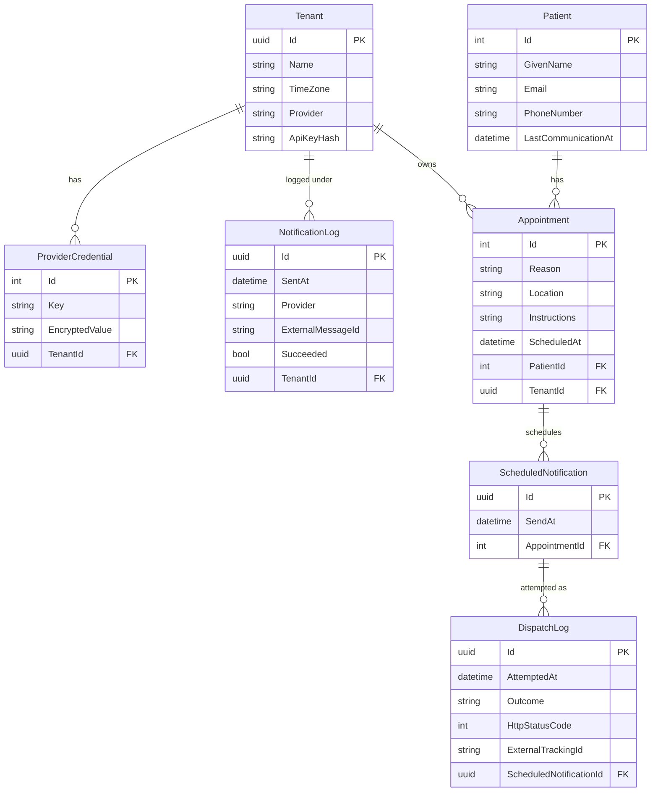

# Notification Service — Entity Relationship Diagram

This ERD describes the current NotificationService persistence model. It is based on:

- `src/NotificationService.Domain/Entities/*`
- `src/NotificationService.Infrastructure/Persistence/NotificationDbContext.cs`

It is a logical diagram of the EF Core model, aligned with the current entity classes and migrations rather than raw SQL export output.

## Diagram

## Relationship Notes

| Relationship | Source in code | Meaning |
|---|---|---|
| `Tenant` 1-to-many `Appointment` | `Appointment.TenantId` | An appointment belongs to a tenant — required so the Scheduler can look up provider credentials when sending. |
| `Tenant` 1-to-many `ProviderCredential` | `Tenant.Credentials`, `ProviderCredential.TenantId` | A tenant can have multiple encrypted provider configuration values. |
| `Tenant` 1-to-many `NotificationLog` | `NotificationLog.TenantId` | Notification attempts are recorded per tenant for invoice verification (NFR 11). |
| `Patient` 1-to-many `Appointment` | `Patient.Appointments`, `Appointment.PatientId` | A patient can have multiple appointments. |
| `Appointment` 1-to-many `ScheduledNotification` | `Appointment.ScheduledNotifications`, `ScheduledNotification.AppointmentId` | Each appointment generates two reminders: 24h and 1h before. |
| `ScheduledNotification` 1-to-many `DispatchLog` | `DispatchLog.ScheduledNotificationId` | Each dispatch attempt is recorded separately so retries, failures, and async-flow status can be tracked without duplicating appointment data. |

## EF Core Configuration Notes

- Table names come from the `DbSet` properties in `NotificationDbContext`: `Tenants`, `Patients`, `Appointments`, `NotificationLogs`, `ProviderCredentials`, `ScheduledNotifications`.
- Table names come from the `DbSet` properties in `NotificationDbContext`: `Tenants`, `Patients`, `Appointments`, `NotificationLogs`, `DispatchLogs`, `ProviderCredentials`, `ScheduledNotifications`.
- Primary keys are inferred by EF Core from the `Id` properties.
- Foreign keys are inferred from `TenantId`, `PatientId`, and `AppointmentId` properties.
- `ProviderCredential.Key` is explicitly configured as required with a maximum length of 256 characters.
- `ProviderCredential.EncryptedValue` is explicitly configured as required — provider secrets are never stored as plain config values (NFR 5).
- `DispatchLog.Outcome` is stored as a string via `.HasConversion<string>()`. This makes rows easier to inspect and decouples the DB from enum ordering.
- `ScheduledNotifications` has an index on `SendAt` — enables efficient polling by the Scheduler.
- `DispatchLogs` has a composite index on `(ScheduledNotificationId, AttemptedAt)` — supports fast lookup of the latest attempt per notification.
- Delete behavior is not explicitly configured. EF Core conventions apply until migrations are generated.

## Model Observations

Design questions the team should be able to defend:

- **`DispatchLog` is the per-attempt audit trail.** The model now records each scheduler/worker attempt against a specific `ScheduledNotification`, which makes retries and async-flow status traceable without putting the appointment payload in the queue or logs.
- **`NotificationLog` remains tenant-scoped.** The model can tell which tenant sent a notification, but not which specific reminder caused a provider response. That separation keeps operational logs lighter and avoids storing unnecessary appointment data.
- **`DispatchLog.ExternalTrackingId` is only populated when a provider returns one.** This is useful for async providers, but the field stays optional so immediate HTTP sends do not need to invent a tracking id.
