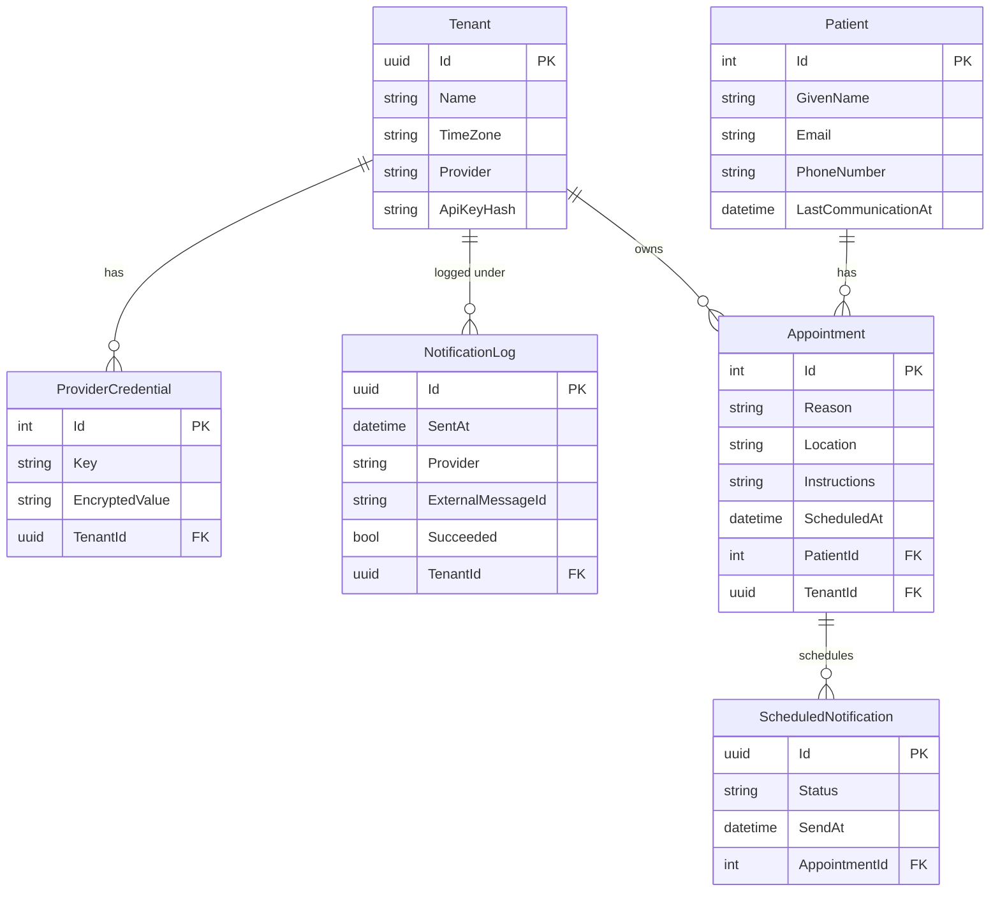

# Notification Service — Entity Relationship Diagram

This ERD describes the current NotificationService persistence model. It is based on:

- `src/NotificationService.Domain/Entities/*`
- `src/NotificationService.Infrastructure/Persistence/NotificationDbContext.cs`

It is a logical diagram of the EF Core model, not generated SQL migration output. At the time of writing, the repository does not contain EF migrations for this context.

## Diagram

## Relationship Notes

| Relationship | Source in code | Meaning |
|---|---|---|
| `Tenant` 1-to-many `Appointment` | `Appointment.TenantId` | An appointment belongs to a tenant — required so the Scheduler can look up provider credentials when sending. |
| `Tenant` 1-to-many `ProviderCredential` | `Tenant.Credentials`, `ProviderCredential.TenantId` | A tenant can have multiple encrypted provider configuration values. |
| `Tenant` 1-to-many `NotificationLog` | `NotificationLog.TenantId` | Notification attempts are recorded per tenant for invoice verification (NFR 11). |
| `Patient` 1-to-many `Appointment` | `Patient.Appointments`, `Appointment.PatientId` | A patient can have multiple appointments. |
| `Appointment` 1-to-many `ScheduledNotification` | `Appointment.ScheduledNotifications`, `ScheduledNotification.AppointmentId` | Each appointment generates two reminders: 24h and 1h before. |

## EF Core Configuration Notes

- Table names come from the `DbSet` properties in `NotificationDbContext`: `Tenants`, `Patients`, `Appointments`, `NotificationLogs`, `ProviderCredentials`, `ScheduledNotifications`.
- Primary keys are inferred by EF Core from the `Id` properties.
- Foreign keys are inferred from `TenantId`, `PatientId`, and `AppointmentId` properties.
- `ProviderCredential.Key` is explicitly configured as required with a maximum length of 256 characters.
- `ProviderCredential.EncryptedValue` is explicitly configured as required — provider secrets are never stored as plain config values (NFR 5).
- `ScheduledNotification.Status` is stored as a string via `.HasConversion<string>()`. This makes rows easier to inspect and decouples the DB from enum ordering.
- `ScheduledNotifications` has a composite index on `(Status, SendAt)` — enables efficient `SELECT FOR UPDATE SKIP LOCKED` polling by the Scheduler.
- Delete behavior is not explicitly configured. EF Core conventions apply until migrations are generated.

## Model Observations

Design questions the team should be able to defend:

- **`Appointment.TenantId` is missing from the current domain entity.** Without it, the Scheduler cannot look up which provider credentials to use when a `ScheduledNotification` fires. This FK must be added to `Appointment` before EF migrations are generated.
- **`NotificationLog` is not linked to `ScheduledNotification` or `Appointment`.** The model can tell which tenant sent a notification, but not which specific reminder caused a provider response. This is intentional — NFR 11 prohibits storing appointment data in logs.
- **Domain entities do not store `externalId`** (the source system's patient/appointment identifier). Without it, idempotent webhook ingestion cannot be enforced at the DB level. This should be added before production.
- **`Tenant.Provider` conflicts with `Tenant.Credentials`.** A tenant has a single `Provider` string AND a collection of `ProviderCredential`. These can disagree. Decide which drives provider selection and remove the other.
