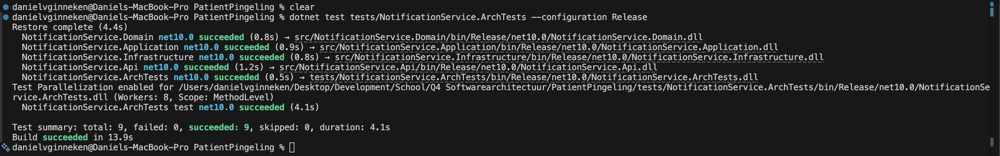

# Testrapportage — Architectuurtesten

## Inleiding

Dit document beschrijft de architectuurtesten van **PatientPingeling**. Architectuurtesten zijn geautomatiseerde testen die de structuur van de code controleren — niet de functionaliteit. Ze bewijzen dat de Clean Architecture-grenzen nooit worden doorbroken, ongeacht toekomstige wijzigingen aan de codebase.

**Waarom zijn dit testen en geen code reviews?**
Een code review controleert de code op één moment. Een architectuurtest draait bij elke commit in CI en geeft automatisch een foutmelding zodra iemand per ongeluk een verkeerde dependency toevoegt — vóórdat het de main branch bereikt.

---

## Clean Architecture — de regels

De codebase volgt Clean Architecture. De kernregel is: **dependencies wijzen altijd naar binnen**.

```
Api / Scheduler / Worker   ← mag alles gebruiken
        │
        ▼
   Application             ← mag alleen Domain gebruiken
        │
        ▼
      Domain               ← gebruikt niets (de kern)
        ▲
        │
   Infrastructure          ← mag Application en Domain gebruiken, maar niet Api
```

Als een laag een dependency heeft op een buitenste laag (bijv. Domain importeert iets uit Infrastructure), zou dat betekenen dat de kern van de businesslogica afhankelijk wordt van een implementatiedetail zoals een database. Dat maakt het systeem onmogelijk te testen en moeilijk te vervangen.

---

## Testresultaten

| Gegeven              | Waarde                          |
| -------------------- | ------------------------------- |
| Testframework        | MSTest 4.2.3                    |
| Library              | NetArchTest.Rules 1.3.2         |
| Testproject          | `NotificationService.ArchTests` |
| Totaal aantal testen | **9**                           |
| Geslaagd             | **9**                           |
| Gefaald              | **0**                           |

```
Passed! - Failed: 0, Passed: 9, Skipped: 0, Total: 9
```

**Uitvoeren (geen Docker nodig):**

```bash
dotnet test tests/NotificationService.ArchTests --configuration Release
```

#### Screenshot — Testresultaten




---

## Overzicht van de architectuurtesten

### Architectuurtest 1 — Domain is niet afhankelijk van Application

| Veld                   | Beschrijving                                                                                     |
| ---------------------- | ------------------------------------------------------------------------------------------------ |
| **Wat wordt getest**   | Klassen in `NotificationService.Domain` importeren niets uit `NotificationService.Application`   |
| **Waarom**             | Entities mogen geen services aanroepen — dat zou de businesslogica in de verkeerde laag plaatsen |
| **Verwacht resultaat** | Geen violations                                                                                  |

---

### Architectuurtest 2 — Domain is niet afhankelijk van Infrastructure

| Veld                   | Beschrijving                                                                                      |
| ---------------------- | ------------------------------------------------------------------------------------------------- |
| **Wat wordt getest**   | Klassen in `NotificationService.Domain` importeren niets uit `NotificationService.Infrastructure` |
| **Waarom**             | Entities mogen niets weten van databases of EF Core — dat maakt ze onafhankelijk en herbruikbaar  |
| **Verwacht resultaat** | Geen violations                                                                                   |

---

### Architectuurtest 3 — Domain is niet afhankelijk van Api

| Veld                   | Beschrijving                                                                           |
| ---------------------- | -------------------------------------------------------------------------------------- |
| **Wat wordt getest**   | Klassen in `NotificationService.Domain` importeren niets uit `NotificationService.Api` |
| **Waarom**             | Entities mogen niets weten van HTTP-concerns zoals endpoints of request-modellen       |
| **Verwacht resultaat** | Geen violations                                                                        |

---

### Architectuurtest 4 — Application is niet afhankelijk van Infrastructure

| Veld                   | Beschrijving                                                                                                             |
| ---------------------- | ------------------------------------------------------------------------------------------------------------------------ |
| **Wat wordt getest**   | Klassen in `NotificationService.Application` importeren niets uit `NotificationService.Infrastructure`                   |
| **Waarom**             | Businesslogica mag niet direct EF Core of RabbitMQ aanroepen — dat loopt via interfaces (Dependency Inversion Principle) |
| **Verwacht resultaat** | Geen violations                                                                                                          |

---

### Architectuurtest 5 — Application is niet afhankelijk van Api

| Veld                   | Beschrijving                                                                                |
| ---------------------- | ------------------------------------------------------------------------------------------- |
| **Wat wordt getest**   | Klassen in `NotificationService.Application` importeren niets uit `NotificationService.Api` |
| **Waarom**             | Businesslogica mag niets weten van hoe het wordt aangesproken (HTTP, CLI, queue)            |
| **Verwacht resultaat** | Geen violations                                                                             |

---

### Architectuurtest 6 — Infrastructure is niet afhankelijk van Api

| Veld                   | Beschrijving                                                                                   |
| ---------------------- | ---------------------------------------------------------------------------------------------- |
| **Wat wordt getest**   | Klassen in `NotificationService.Infrastructure` importeren niets uit `NotificationService.Api` |
| **Waarom**             | Data-access heeft niets te maken met HTTP-endpoints — scheiding van verantwoordelijkheden      |
| **Verwacht resultaat** | Geen violations                                                                                |

---

### Architectuurtest 7 — Interfaces beginnen met `I`

| Veld                   | Beschrijving                                                                    |
| ---------------------- | ------------------------------------------------------------------------------- |
| **Wat wordt getest**   | Alle interfaces in `NotificationService.Application` beginnen met de letter `I` |
| **Waarom**             | .NET naamgevingsconventie — maakt interfaces direct herkenbaar in code          |
| **Verwacht resultaat** | Geen violations                                                                 |

---

### Architectuurtest 8 — Services eindigen op `Service`

| Veld                   | Beschrijving                                                                                                  |
| ---------------------- | ------------------------------------------------------------------------------------------------------------- |
| **Wat wordt getest**   | Alle klassen in Application die eindigen op `Service` wonen in de `NotificationService.Application` namespace |
| **Waarom**             | Consistente naamgeving maakt de codebase voorspelbaar voor alle teamleden                                     |
| **Verwacht resultaat** | Geen violations                                                                                               |

---

### Architectuurtest 9 — DbContext alleen in Infrastructure

| Veld                   | Beschrijving                                                                                                                                  |
| ---------------------- | --------------------------------------------------------------------------------------------------------------------------------------------- |
| **Wat wordt getest**   | Geen enkele `DbContext`-subklasse bestaat buiten de Infrastructure-laag                                                                       |
| **Waarom**             | Als `DbContext` in Application of Domain terechtkwam, zou businesslogica de database direct kunnen bevragen en de repository-pattern omzeilen |
| **Verwacht resultaat** | 0 violerende klassen                                                                                                                          |
