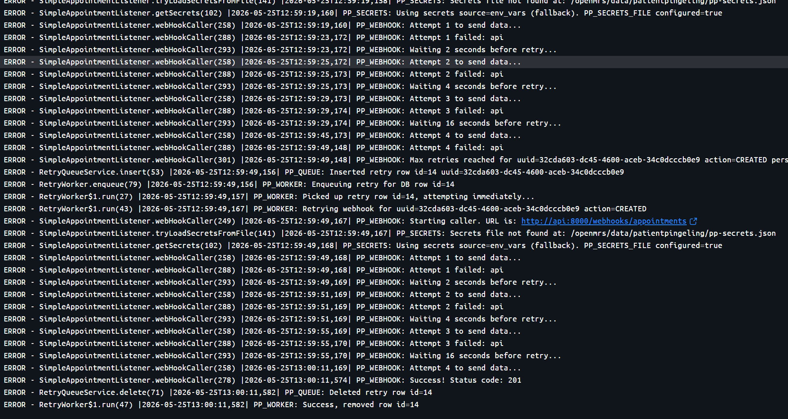
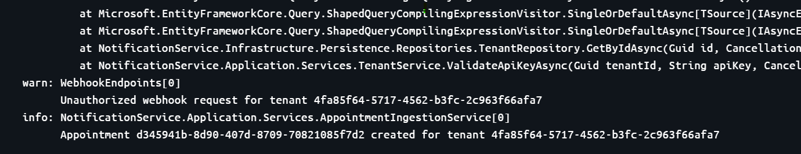

# Testrapportage — Chaos Testen (handmatig)

## Inleiding

Dit document is de testrapportage voor de **chaos testen** van de PatientPingeling communicatiemodule. Het doel van deze rapportage is aan te tonen dat het systeem betrouwbaar blijft onder omstandigheden waarbij één of meerdere componenten uitvallen.

In tegenstelling tot de unit testen worden hier **geen mocks** gebruikt. De testen worden uitgevoerd in de volledige Docker Compose omgeving, waarbij componenten handmatig worden gestopt om uitval te simuleren.

---

## Testomgeving

| Gegeven         | Waarde                          |
| --------------- | ------------------------------- |
| Testtype        | Handmatig / exploratief         |
| Omgeving        | Docker Compose (lokaal)         |
| Datum           | 24-05-2026                      |
| Componenten     | OpenMRS, Enricher plugin, API, Database, Notification worker, RabbitMQ |

---

## Testresultaten

| # | Scenario                                      | Verwacht resultaat                                              | Uitkomst |
|---|-----------------------------------------------|-----------------------------------------------------------------|----------|
| 1 | API offline — enricher kan webhook niet sturen | Events worden opgeslagen in Transactional outbox en automatisch opnieuw verzonden | ✅ Geslaagd |
| 2 | Database offline — API en scheduler onbereikbaar | Requests worden geweigerd met 503, geen dataverlies            | ✅ Geslaagd |
| 3 | Notification worker down — queue accumuleert  | Berichten blijven in RabbitMQ queue, worker verwerkt bij herstart | ✅ Geslaagd |
| 4 | Scheduler background service down — scheduled notifications blijven in DB hangen  | Scheduled notifications staan klaar en worden opgepakt door scheduler wanneer deze weer online is | ✅ Geslaagd |

---

## Scenario 1 — API offline: Enricher plugin kan webhook niet afleveren

### Beschrijving

De API-container wordt gestopt terwijl OpenMRS actief is. Er wordt een afspraak aangemaakt of gewijzigd in OpenMRS, wat een event triggert in de Enricher plugin.

### Teststappen

1. Stop de API-container: `docker stop api`
2. Maak een afspraak aan of wijzig een bestaande afspraak in OpenMRS
3. Observeer de OpenMRS logs
4. Start de API-container opnieuw: `docker start api`
5. Observeer of het event alsnog afgeleverd wordt

### Verwacht gedrag

- De Enricher plugin probeert het webhook-verzoek **4 keer** te sturen met exponentiële backoff (2s, 4s, 16s, 16s)
- Na 4 mislukte pogingen wordt het event opgeslagen in de **`patientpingeling_retry_queue`** tabel in de database
- Een achtergrondworker (`RetryWorker`) pikt het event op en blijft elke 30 seconden opnieuw proberen
- Zodra de API weer online is, wordt het event alsnog afgeleverd en verwijderd uit de tabel
- Bij een herstart van OpenMRS worden openstaande rijen uit de tabel opnieuw opgepikt

### Waargenomen gedrag

## Scenario 2 — Database offline: API en scheduler onbereikbaar

### Beschrijving

De database-container wordt gestopt terwijl de API en scheduler actief zijn. Er wordt een webhook-verzoek gestuurd naar de API en de scheduler probeert notifications op te halen.

### Teststappen

1. Stop de database-container: `docker stop db`
2. Stuur een webhook-verzoek naar de API
3. Observeer de API-response en logs
4. Observeer het gedrag van de scheduler
5. Start de database opnieuw: `docker start db`
6. Observeer of het systeem zichzelf herstelt

### Verwacht gedrag

- De API retourneert een **401 Unauthorized** omdat de tenant-validatie de database niet kan bereiken
- De Enricher plugin interpreteert een 401 als een tijdelijke fout en blijft **herhaalpogingen** doen
- De scheduler kan geen notifications ophalen en logt een fout, maar crasht niet
- Na herstart van de database herstelt de API zichzelf en worden nieuwe verzoeken weer verwerkt
  
### Waargenomen gedrag

- API retourneert 401 bij database-uitval
- Enricher plugin herhaalt pogingen conform het retry-mechanisme van scenario 1
- Scheduler logt databasefouten maar blijft draaien
- Na herstart database: systeem volledig operationeel zonder handmatige interventie

## Scenario 3 — Notification worker down: RabbitMQ queue accumuleert berichten

### Beschrijving

De notification worker-container wordt gestopt. De scheduler blijft berichten publiceren naar de RabbitMQ queue. Na herstart van de worker worden alle geaccumuleerde berichten verwerkt.

### Teststappen

1. Stop de notification worker: `docker stop notification-worker`
2. Laat de scheduler draaien en afspraken naderen zodat notifications gepubliceerd worden
3. Observeer de RabbitMQ management interface — berichten zouden moeten accumuleren
4. Start de notification worker opnieuw: `docker start notification-worker`
5. Observeer of geaccumuleerde berichten worden verwerkt

### Verwacht gedrag

- De RabbitMQ queue accumuleert berichten zolang de worker offline is
- Berichten **verlopen niet** — RabbitMQ bewaart ze totdat een consumer ze ophaalt
- Bij herstart van de worker worden alle geaccumuleerde berichten in volgorde verwerkt
- Geen enkel bericht gaat verloren

### Waargenomen gedrag

- RabbitMQ queue toonde oplopend aantal berichten tijdens uitval van de worker
- Na herstart van de worker: alle geaccumuleerde berichten verwerkt
- Geen verloren berichten geconstateerd

## Scenario 4 — Scheduler background service down: scheduled notifications blijven in DB

### Beschrijving

De scheduler-backgroundservice wordt gestopt terwijl de API en database blijven draaien. Nieuwe of bestaande afspraken die notificaties zouden moeten aanmaken, blijven in de database staan. Zodra de scheduler weer online komt, pakt deze de klaarstaande scheduled notifications uit de database en publiceert ze naar de RabbitMQ queue.

### Teststappen

1. Stop de scheduler-container: `docker stop scheduler`
2. Laat de API en database draaien en creëer of update afspraken in OpenMRS zodat er scheduled notifications worden aangemaakt
3. Controleer in de database (tabel `ScheduledNotification`) dat de notificaties aanwezig blijven
4. Start de scheduler opnieuw: `docker start scheduler`
5. Observeer of de scheduler de notificaties oppakt en naar RabbitMQ publiceert

### Verwacht gedrag

- Nieuwe of bestaande scheduled notifications blijven in de database zolang de scheduler offline is
- De scheduler crasht niet bij database-toegang; hij herstelt wanneer de service weer start
- Bij herstart pakt de scheduler alle ready notifications op en publiceert ze naar de queue in juiste volgorde
- Geen notificaties gaan verloren doordat ze in de DB bewaard blijven

### Waargenomen gedrag

- `ScheduledNotification`-rijen bleven onveranderd in de database tijdens uitval van de scheduler
- Na herstart van de scheduler werden de klaarstaande notificaties verwerkt en naar RabbitMQ gepubliceerd
- Geen verloren of dubbel verzonden notificaties waargenomen
