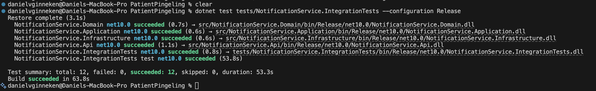

# Testrapportage — Integratie Testen (Geautomatiseerd)

## Inleiding

Dit document beschrijft de geautomatiseerde integratietesten van de **PatientPingeling Notification API**. Integratietesten valideren hoe meerdere componenten samenwerken met echte infrastructuur: de Notification API, de PostgreSQL-database en RabbitMQ draaien allemaal echt — automatisch opgestart via **Testcontainers**.

Het verschil met unit testen: unit testen testen één klasse in isolatie met nep-dependencies (mocks). Integratietesten bewijzen dat de samenwerking tussen die klassen ook in productie-achtige omstandigheden correct werkt.

---

## Testresultaten

| Gegeven              | Waarde                                                               |
| -------------------- | -------------------------------------------------------------------- |
| Testframework        | MSTest 4.2.3                                                         |
| Infrastructuur       | Testcontainers (PostgreSQL 18-alpine + RabbitMQ 4-management-alpine) |
| Testproject          | `NotificationService.IntegrationTests`                               |
| Totaal aantal testen | **12**                                                               |
| Geslaagd             | **12**                                                               |
| Gefaald              | **0**                                                                |

```
Passed! - Failed: 0, Passed: 12, Skipped: 0, Total: 12
```

**Uitvoeren (Docker vereist):**

```bash
dotnet test tests/NotificationService.IntegrationTests --configuration Release
```

#### Screenshot — Testresultaten




---

## Opstartproces

Vóór de testen start Testcontainers automatisch twee Docker-containers op:

| Container  | Image                          | Doel                                                           |
| ---------- | ------------------------------ | -------------------------------------------------------------- |
| PostgreSQL | `postgres:18-alpine`           | Echte database voor EF Core-migraties en dataverificatie       |
| RabbitMQ   | `rabbitmq:4-management-alpine` | Message broker (aanwezig als onderdeel van de volledige stack) |

`WebApplicationFactory<Program>` bouwt de volledige API op met de containerconnectie-strings. EF Core-migraties draaien automatisch bij het opstarten. Er wordt een testtenant aangemaakt zodat alle testen zich kunnen authenticeren.

---

## Overzicht van de integratietesten

### Integratie Test 1 — Ontbrekende `X-Tenant-Id` header geeft 400

| Veld                   | Beschrijving                                                                                        |
| ---------------------- | --------------------------------------------------------------------------------------------------- |
| **Methode**            | `POST /webhooks/appointments`                                                                       |
| **Wat wordt getest**   | Verzoek zonder `X-Tenant-Id` header wordt geweigerd                                                 |
| **Waarom**             | De API moet altijd een tenant-context hebben — zonder header kan het verzoek niet worden gerouteerd |
| **Randvoorwaarden**    | Docker actief (Testcontainers start automatisch)                                                    |
| **Verwacht resultaat** | HTTP 400 Bad Request                                                                                |
| **Triggered door**     | GitHub Actions CI / `dotnet test`                                                                   |

---

### Integratie Test 2 — Ontbrekende `X-Api-Key` header geeft 400

| Veld                   | Beschrijving                                                                        |
| ---------------------- | ----------------------------------------------------------------------------------- |
| **Methode**            | `POST /webhooks/appointments`                                                       |
| **Wat wordt getest**   | Verzoek zonder `X-Api-Key` header wordt geweigerd vóórdat authenticatie plaatsvindt |
| **Waarom**             | Vroeg falen bij ontbrekende headers voorkomt onnodige database-aanroepen            |
| **Randvoorwaarden**    | Docker actief                                                                       |
| **Verwacht resultaat** | HTTP 400 Bad Request                                                                |
| **Triggered door**     | GitHub Actions CI / `dotnet test`                                                   |

---

### Integratie Test 3 — Ongeldige API-key geeft 401

| Veld                   | Beschrijving                                                                  |
| ---------------------- | ----------------------------------------------------------------------------- |
| **Methode**            | `POST /webhooks/appointments`                                                 |
| **Wat wordt getest**   | Verzoek met een verkeerde API-key wordt geweigerd na PBKDF2-hash-vergelijking |
| **Waarom**             | Beveiligingsvereiste: alleen geauthenticeerde tenants mogen data insturen     |
| **Randvoorwaarden**    | Docker actief, testtenant aanwezig in database                                |
| **Verwacht resultaat** | HTTP 401 Unauthorized                                                         |
| **Triggered door**     | GitHub Actions CI / `dotnet test`                                             |

---

### Integratie Test 4 — Geldig CREATED-verzoek geeft 201

| Veld                   | Beschrijving                                                                                                      |
| ---------------------- | ----------------------------------------------------------------------------------------------------------------- |
| **Methode**            | `POST /webhooks/appointments`                                                                                     |
| **Wat wordt getest**   | Happy path: een nieuw appointment wordt correct verwerkt door routing, authenticatie, validatie en businesslogica |
| **Waarom**             | Kernfunctionaliteit van het systeem                                                                               |
| **Randvoorwaarden**    | Docker actief, testtenant aanwezig                                                                                |
| **Verwacht resultaat** | HTTP 201 Created                                                                                                  |
| **Triggered door**     | GitHub Actions CI / `dotnet test`                                                                                 |

---

### Integratie Test 5 — Geldig CREATED-verzoek persisteert naar de database

| Veld                   | Beschrijving                                                                                                |
| ---------------------- | ----------------------------------------------------------------------------------------------------------- |
| **Methode**            | `POST /webhooks/appointments`                                                                               |
| **Wat wordt getest**   | Na een 201-response staat het appointment daadwerkelijk in PostgreSQL                                       |
| **Waarom**             | Een 201 bewijst alleen dat de API reageerde — deze test bewijst dat data ook echt is opgeslagen via EF Core |
| **Randvoorwaarden**    | Docker actief, directe DB-query na de aanroep                                                               |
| **Verwacht resultaat** | `Appointment` met het opgegeven `ExternalId` en `TenantId` bestaat in de database                           |
| **Triggered door**     | GitHub Actions CI / `dotnet test`                                                                           |

---

### Integratie Test 6 — Duplicaat appointment geeft 200 (idempotentie)

| Veld                   | Beschrijving                                                                                            |
| ---------------------- | ------------------------------------------------------------------------------------------------------- |
| **Methode**            | `POST /webhooks/appointments` (twee keer dezelfde payload)                                              |
| **Wat wordt getest**   | Een tweede identiek CREATED-verzoek wordt silently genegeerd                                            |
| **Waarom**             | Idempotentie is een kerneigenschap — webhook-berichten kunnen door het netwerk dubbel worden afgeleverd |
| **Randvoorwaarden**    | Docker actief, eerste verzoek al verwerkt                                                               |
| **Verwacht resultaat** | HTTP 200 OK met `{ "message": "Appointment already exists." }`                                          |
| **Triggered door**     | GitHub Actions CI / `dotnet test`                                                                       |

---

### Integratie Test 7 — Geldig UPDATED-verzoek geeft 201

| Veld                   | Beschrijving                                                                                         |
| ---------------------- | ---------------------------------------------------------------------------------------------------- |
| **Methode**            | `POST /webhooks/appointments`                                                                        |
| **Wat wordt getest**   | Een bestaand appointment updaten met een nieuw tijdstip                                              |
| **Waarom**             | UPDATED-events moeten de bestaande data correct bijwerken en geplande notificaties opnieuw berekenen |
| **Randvoorwaarden**    | Docker actief, appointment bestaat al (eerst CREATED gestuurd)                                       |
| **Verwacht resultaat** | HTTP 201 Created                                                                                     |
| **Triggered door**     | GitHub Actions CI / `dotnet test`                                                                    |

---

### Integratie Test 8 — UPDATED voor niet-bestaand appointment maakt nieuw aan (upsert)

| Veld                   | Beschrijving                                                                                    |
| ---------------------- | ----------------------------------------------------------------------------------------------- |
| **Methode**            | `POST /webhooks/appointments`                                                                   |
| **Wat wordt getest**   | UPDATED voor een onbekend appointment resulteert in een nieuw appointment (upsert)              |
| **Waarom**             | UPDATED-events kunnen binnenkomen voordat het CREATED-event is verwerkt door netwerk-reordering |
| **Randvoorwaarden**    | Docker actief, appointment bestaat **niet** in database                                         |
| **Verwacht resultaat** | HTTP 201 Created                                                                                |
| **Triggered door**     | GitHub Actions CI / `dotnet test`                                                               |

---

### Integratie Test 9 — Bestaand appointment CANCELLED geeft 201

| Veld                   | Beschrijving                                                                                  |
| ---------------------- | --------------------------------------------------------------------------------------------- |
| **Methode**            | `POST /webhooks/appointments`                                                                 |
| **Wat wordt getest**   | Een bestaand appointment annuleren markeert het als geannuleerd en stopt pending notificaties |
| **Waarom**             | CANCELLED-events moeten altijd worden verwerkt als het appointment bestaat                    |
| **Randvoorwaarden**    | Docker actief, appointment bestaat (eerst CREATED gestuurd)                                   |
| **Verwacht resultaat** | HTTP 201 Created                                                                              |
| **Triggered door**     | GitHub Actions CI / `dotnet test`                                                             |

---

### Integratie Test 10 — CANCELLED voor niet-bestaand appointment geeft 404

| Veld                   | Beschrijving                                                                         |
| ---------------------- | ------------------------------------------------------------------------------------ |
| **Methode**            | `POST /webhooks/appointments`                                                        |
| **Wat wordt getest**   | Een annulering van een appointment dat niet bestaat geeft een duidelijke foutmelding |
| **Waarom**             | Het systeem mag nooit stilletjes falen bij een annulering van een onbekende afspraak |
| **Randvoorwaarden**    | Docker actief, appointment bestaat **niet** in database                              |
| **Verwacht resultaat** | HTTP 404 Not Found                                                                   |
| **Triggered door**     | GitHub Actions CI / `dotnet test`                                                    |

---

### Integratie Test 11 — Ongeldige payload geeft 400

| Veld                   | Beschrijving                                                                                 |
| ---------------------- | -------------------------------------------------------------------------------------------- |
| **Methode**            | `POST /webhooks/appointments`                                                                |
| **Wat wordt getest**   | Een payload met lege velden, `UNKNOWN` action en een datum in het verleden wordt geweigerd   |
| **Waarom**             | FluentValidation moet ongeldige input onderscheppen vóórdat businesslogica wordt aangeroepen |
| **Randvoorwaarden**    | Docker actief                                                                                |
| **Verwacht resultaat** | HTTP 400 Bad Request                                                                         |
| **Triggered door**     | GitHub Actions CI / `dotnet test`                                                            |

---

### Integratie Test 12 — Onbekend tenant-ID geeft 401

| Veld                   | Beschrijving                                                                          |
| ---------------------- | ------------------------------------------------------------------------------------- |
| **Methode**            | `POST /webhooks/appointments`                                                         |
| **Wat wordt getest**   | Verzoek met een niet-bestaand tenant-ID wordt geweigerd                               |
| **Waarom**             | De API retourneert 401 (niet 404) om te voorkomen dat het bestaan van tenants uitlekt |
| **Randvoorwaarden**    | Docker actief, opgegeven tenant bestaat **niet** in database                          |
| **Verwacht resultaat** | HTTP 401 Unauthorized                                                                 |
| **Triggered door**     | GitHub Actions CI / `dotnet test`                                                     |

---

