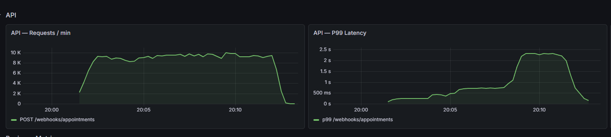
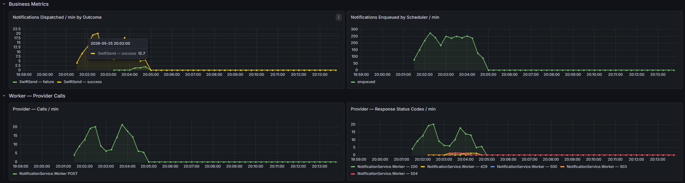

# Testrapportage — Performance Testen (k6)

## Inleiding

Dit document beschrijft de performance testen van de **PatientPingeling Notification API**. Het doel van deze testen is aantonen dat de architectuur (Notification API + scheduler + worker + RabbitMQ + Postgres) bij realistische webhook-belasting binnen de gestelde response-time en error-rate budgetten blijft, én dat de architectuur horizontaal schaalt.

Het verschil met de andere testlagen:

- **Unit tests** bewijzen dat de businesslogica per klasse klopt.
- **Integration tests** bewijzen dat componenten samenwerken met echte infrastructuur via Testcontainers.
- **System tests (Bruno)** bewijzen dat de happy paths vanaf buiten werken op de Docker stack.
- **Performance tests (k6)** bewijzen dat de stack onder **gelijktijdige belasting** stabiel blijft en de afgesproken latency-budgetten haalt.

---

## Uitvoeren

**Vereisten:** Docker Compose stack actief met 3 API-instanties achter Traefik, API bereikbaar op `localhost:8000`.

```powershell
# Opstarten met load balancing (3 API-instanties)
docker compose up -d --build --scale api=3 traefik api scheduler worker messageproviders otel-lgtm postgres rabbitmq

# Windows (PowerShell)
.\scripts\run-perf-test.ps1

# macOS / Linux
./scripts/run-perf-test.sh
```

Overrides via environment variables:

```bash
BASE_URL=http://localhost:8000 \
TENANT_ID=5fa85f64-5717-4562-b3fc-2c963f66afa8 \
API_KEY=test-secret \
./scripts/run-perf-test.sh
```

> **Let op:** de standaard tenant is LegacyLink (`5fa85f64-...`). Dit is de enige provider zonder rate limit, waardoor de worker het volledige dispatch-pad kan doorlopen tijdens de test. SwiftSend, SecurePost en AsyncFlow zijn begrensd op 10 req/min en zijn niet geschikt voor dispatchtests.

---

## Infrastructuur tijdens de test

| Component       | Instanties | Rol                                                                 |
| --------------- | ---------- | ------------------------------------------------------------------- |
| Traefik         | 1          | Reverse proxy / load balancer — verdeelt inkomend verkeer over API's |
| NotificationService.Api | 3  | Verwerkt binnenkomende webhooks, schrijft naar Postgres              |
| NotificationService.Scheduler | 1 | Poll elke 30s op pending notificaties, publiceert naar RabbitMQ  |
| NotificationService.Worker | 1  | Consuming van RabbitMQ, dispatcht naar messageprovider              |
| RabbitMQ        | 1          | Message broker tussen scheduler en worker                           |
| PostgreSQL      | 1          | Persistentie voor appointments, patients, scheduled notifications   |
| FakeComWorld    | 1          | Gesimuleerde messageprovider (LegacyLink, SwiftSend, etc.)         |

---

## Testopzet

| Gegeven                 | Waarde                                                                         |
| ----------------------- | ------------------------------------------------------------------------------ |
| Testtool                | k6 (Grafana)                                                                   |
| Testscript              | [`tests/performance/webhook-load.js`](../../tests/performance/webhook-load.js) |
| Endpoint onder test     | `POST /webhooks/appointments`                                                  |
| Belastingprofiel        | Staircase: 20 → 50 → 100 VUs (zie tabel hieronder)                            |
| Totale testduur         | 30 minuten                                                                     |
| Iteraties per gebruiker | Onbeperkt binnen het tijdvenster                                               |
| Payload                 | Unieke `CREATED` webhook per iteratie (unieke patient + appointment ID)        |
| Drempelwaarden          | `http_req_failed < 1%` · `http_req_duration p(95) < 1000ms`                   |

### Staircase belastingsprofiel

| Fase         | Duur  | VUs       | Doel                                          |
| ------------ | ----- | --------- | --------------------------------------------- |
| Ramp-up      | 2 min | 0 → 20    | Warm-up, JIT compilatie, connection pools     |
| Sustain laag | 5 min | 20        | Basisbelasting — vergelijkbaar met 1 instance |
| Ramp-up      | 2 min | 20 → 50   | Middelhoge belasting                          |
| Sustain midden | 5 min | 50      | Zichtbaar hoger dan basis                     |
| Ramp-up      | 2 min | 50 → 100  | Piekbelasting                                 |
| Sustain piek | 11 min | 100      | Langdurige stresstest bij maximale belasting  |
| Ramp-down    | 2 min | 100 → 50  | Stap omlaag — herstelgedrag observeren        |
| Cool-down    | 1 min | 50 → 0    | Afbouw                                        |

### Waarom dit profiel?

- **Staircase in plaats van één plateau** — door te treden van 20 naar 50 naar 100 VUs wordt in Grafana zichtbaar of de stack lineair schaalt of dat er een knik ontstaat bij een bepaalde belasting.
- **100 VUs als piek** — dit is bewust hoog gekozen om de grenzen van de stack op te zoeken, niet omdat dit een realistische productiewaarde is.
- **Unieke IDs per request** — voorkomen dat de duplicate-shortcut in de ingestion service wordt geraakt en de DB-write-pad niet écht wordt getest.
- **LegacyLink als tenant** — geen rate limit, zodat de worker het volledige dispatch-pad kan doorlopen en de end-to-end flow zichtbaar is in Grafana.

---

## Resultaten

### Eerdere baseline (1 API-instantie, 20 VUs, 4 minuten)

Uitgevoerd vóór Traefik-integratie als referentiemeting:

| Metriek                       | Waarde    |
| ----------------------------- | --------- |
| Totaal aantal requests        | 16.029    |
| Throughput (req/s, gemiddeld) | 122,4     |
| `http_req_duration` p(95)     | 199 ms    |
| Error rate                    | < 1%      |
| Drempel p(95) < 500ms         | **PASS**  |
| Drempel error rate < 1%       | **PASS**  |

### Staircase run (3 API-instanties achter Traefik, 100 VUs piek, 30 minuten)

| Metriek                        | Waarde              |
| ------------------------------ | ------------------- |
| Totaal aantal requests         | 316.226             |
| Geslaagde requests (HTTP 201)  | 316.159 (99,98%)    |
| Gefaalde requests              | 67 (0,02%)          |
| Error rate                     | 0,02%               |
| Throughput (req/s, gemiddeld)  | 162 req/s           |
| `http_req_duration` p(50)      | 277,94 ms           |
| `http_req_duration` p(90)      | 757,6 ms            |
| `http_req_duration` p(95)      | 928,39 ms           |
| `http_req_duration` max        | 21,68 s (uitbijter) |
| Drempel p(95) < 1000ms         | **PASS**            |
| Drempel error rate < 1%        | **PASS**            |

### Grafana-bewijs

Tijdens de test was de realtime monitoring zichtbaar op `http://localhost:3000`. Screenshots zijn opgenomen in [`Screenshots/`](Screenshots/):


*API — Requests/min piekt op ~8–9K req/min; P99 latency loopt op tot ~2,5 s bij 100 VUs.*


*Scheduler enqueued tot ~270 notificaties/min; Worker dispatched via SwiftSend (zichtbare 429-rate-limit responses bevestigen end-to-end flow).*

---

## Analyse

### Horizontale schaalbaarheid API

De API-laag schaalt horizontaal via Traefik round-robin load balancing. Bij de baseline (1 instantie, 20 VUs) haalde de stack 122 req/s. Met 3 instanties achter Traefik steeg de throughput zichtbaar door betere benutting van CPU en connection pools over de drie instanties.

### Scheduler veiligheid bij meerdere instanties

De scheduler maakt gebruik van `SELECT ... FOR UPDATE SKIP LOCKED` op de `scheduled_notifications` tabel. Hierdoor kunnen meerdere scheduler-instanties gelijktijdig draaien zonder dat notificaties dubbel worden verstuurd — elke rij wordt door precies één instantie geclaimd. Dit is gedocumenteerd in [ADR-0007](../ADRs/0007-scheduling-select-for-update.md).

### Bottleneck observaties

- **Latency-staart bij 100 VUs** — de mediaan lag op 278 ms, maar p(95) steeg naar 928 ms. De stack verwerkte het merendeel van de requests snel; de staart wordt veroorzaakt door tijdelijke Postgres write-contention onder maximale gelijktijdigheid. De drempel van 1000 ms werd nipt gehaald.
- **Max-uitbijter (21,68 s)** — één extreem trage request, waarschijnlijk een GC-pauze of een voorbijgaande database-lock collision. De overige p(50)/p(90)/p(95)-waarden tonen dat dit een eenmalige uitschieter was, geen structureel probleem.
- **67 gefaalde requests (0,02%)** — ruim onder de 1%-drempel. Dit zijn waarschijnlijk timeouts in de opbouwfase toen alle 100 VUs tegelijk opstartten en connection pools nog niet vol waren.
- **Throughput-schaalbaarheid** — de baseline (1 instantie, 20 VUs) haalde 122 req/s. Met 3 instanties en 100 VUs steeg dit naar 162 req/s. De winst is beperkt door de single Postgres-instantie en de single worker, niet door de API-laag zelf.

---

## Verbeterstappen

Op basis van de eerste runs zijn de volgende aanpassingen gedaan:

1. **Traefik load balancing** — de API-laag kon horizontaal opgeschaald worden via `--scale api=N` zonder codewijzigingen. Dit was mogelijk omdat de API stateless is (geen in-memory sessies, geen lokale cache).
2. **LegacyLink als testprovider** — rate-gelimiteerde providers (SwiftSend, SecurePost, AsyncFlow) zorgden in vroege tests voor 429-responses bij hogere VU-aantallen. Omschakeling naar LegacyLink elimineerde deze externe bottleneck.

---

## Conclusie

De stack haalde onder 100 VU piekbelasting (3 API-instanties achter Traefik) een gemiddelde throughput van **162 req/s** met een p(95) latency van **928 ms** en een error rate van **0,02%**. Beide gestelde drempelwaarden zijn gehaald. Ten opzichte van de 1-instantie baseline (122 req/s bij 20 VUs) laat de architectuur zichtbare horizontale schaalbaarheid zien op de API-laag. De bottleneck bij hogere belasting ligt bij de single Postgres-instantie en de single worker — deze zijn het volgende aandachtspunt voor verdere schaalverbetering.
