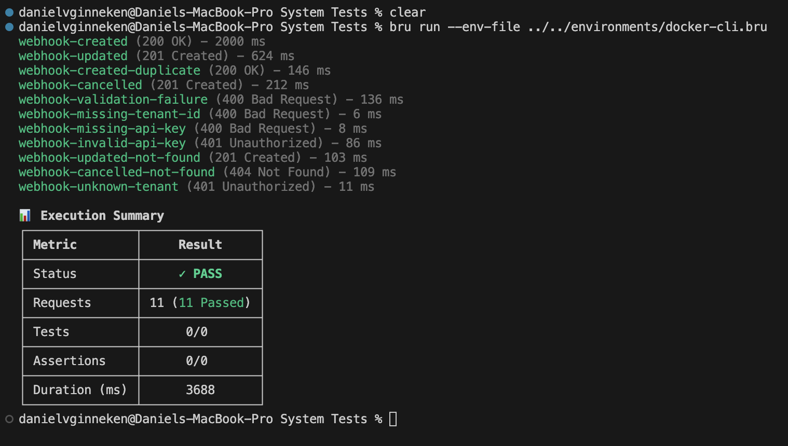

# Testrapportage — Systeem Testen (Bruno)

## Inleiding

Dit document beschrijft de systeem testen van **PatientPingeling**. Systeem testen testen de **volledige draaiende applicatie van buitenaf** — alsof je een echte OpenMRS-installatie bent die events stuurt. Ze draaien tegen de volledige Docker Compose-stack inclusief Notification API, PostgreSQL, RabbitMQ, Scheduler en Worker.

Het verschil met integratietesten (Testcontainers): integratietesten starten automatisch in CI en testen de API + database als geheel. Systeem testen worden handmatig uitgevoerd via **Bruno** en testen de volledige stack inclusief screenshots als bewijs.

---

## Uitvoeren

**Vereisten:** Docker Compose stack actief (`docker compose up`), Bruno geïnstalleerd.

```bash
# Via Bruno CLI (vanuit de repo root)
cd bruno/collections/"System Tests"
bru run --env-file ../../environments/docker-cli.bru

# Of open de Bruno app, selecteer de 'docker' environment en run de 'System Tests' collectie
```

---

## Overzicht van de systeem testen

### Systeem Test 1 — webhook CREATED (happy path)

| Veld                   | Beschrijving                                                                                 |
| ---------------------- | -------------------------------------------------------------------------------------------- |
| **Componenten**        | Bruno → Notification API → PostgreSQL                                                        |
| **Wat wordt getest**   | Een nieuw appointment aanmaken via de webhook endpoint                                       |
| **Waarom**             | Dit is de kernfunctionaliteit — een CREATED event van OpenMRS moet correct worden opgeslagen |
| **Randvoorwaarden**    | Docker Compose stack actief (`docker compose up`), testtenant aanwezig in database           |
| **Verwacht resultaat** | HTTP 201 Created                                                                             |
| **Triggered door**     | Handmatig via Bruno                                                                          |

---

### Systeem Test 2 — webhook UPDATED

| Veld                   | Beschrijving                                                                                         |
| ---------------------- | ---------------------------------------------------------------------------------------------------- |
| **Componenten**        | Bruno → Notification API → PostgreSQL                                                                |
| **Wat wordt getest**   | Een bestaand appointment updaten (nieuw tijdstip, gewijzigde patiëntdata)                            |
| **Waarom**             | UPDATED-events moeten de bestaande data correct bijwerken en geplande notificaties opnieuw berekenen |
| **Randvoorwaarden**    | Docker Compose stack actief, test 1 (CREATED) al uitgevoerd zodat het appointment bestaat            |
| **Verwacht resultaat** | HTTP 201 Created                                                                                     |
| **Triggered door**     | Handmatig via Bruno                                                                                  |

---

### Systeem Test 3 — webhook CREATED duplicate (idempotent)

| Veld                   | Beschrijving                                                                                            |
| ---------------------- | ------------------------------------------------------------------------------------------------------- |
| **Componenten**        | Bruno → Notification API → PostgreSQL                                                                   |
| **Wat wordt getest**   | Dezelfde CREATED-payload een tweede keer sturen wordt silently genegeerd                                |
| **Waarom**             | Idempotentie is een kerneigenschap — webhook-berichten kunnen door het netwerk dubbel worden afgeleverd |
| **Randvoorwaarden**    | Docker Compose stack actief, test 1 (CREATED) al uitgevoerd                                             |
| **Verwacht resultaat** | HTTP 200 OK, body: `{ "message": "Appointment already exists." }`                                       |
| **Triggered door**     | Handmatig via Bruno                                                                                     |

---

### Systeem Test 4 — webhook CANCELLED

| Veld                   | Beschrijving                                                                                     |
| ---------------------- | ------------------------------------------------------------------------------------------------ |
| **Componenten**        | Bruno → Notification API → PostgreSQL                                                            |
| **Wat wordt getest**   | Een bestaand appointment annuleren via de webhook endpoint                                       |
| **Waarom**             | CANCELLED-events moeten pending notificaties stoppen en het appointment als geannuleerd markeren |
| **Randvoorwaarden**    | Docker Compose stack actief, het appointment bestaat in de database                              |
| **Verwacht resultaat** | HTTP 201 Created                                                                                 |
| **Triggered door**     | Handmatig via Bruno                                                                              |

---

### Systeem Test 5 — webhook validation failure

| Veld                   | Beschrijving                                                                                   |
| ---------------------- | ---------------------------------------------------------------------------------------------- |
| **Componenten**        | Bruno → Notification API (validatielaag)                                                       |
| **Wat wordt getest**   | Een payload met ongeldige data (lege velden, `UNKNOWN` action, verleden datum) wordt geweigerd |
| **Waarom**             | FluentValidation moet ongeldige input onderscheppen vóórdat businesslogica wordt aangeroepen   |
| **Randvoorwaarden**    | Docker Compose stack actief                                                                    |
| **Verwacht resultaat** | HTTP 400 Bad Request                                                                           |
| **Triggered door**     | Handmatig via Bruno                                                                            |

---

### Systeem Test 6 — webhook missing X-Tenant-Id header

| Veld                   | Beschrijving                                                                            |
| ---------------------- | --------------------------------------------------------------------------------------- |
| **Componenten**        | Bruno → Notification API (endpoint-validatie)                                           |
| **Wat wordt getest**   | Verzoek zonder `X-Tenant-Id` header wordt direct geweigerd                              |
| **Waarom**             | Zonder tenant-context kan het verzoek niet worden verwerkt — vroeg falen is efficiënter |
| **Randvoorwaarden**    | Docker Compose stack actief                                                             |
| **Verwacht resultaat** | HTTP 400 Bad Request                                                                    |
| **Triggered door**     | Handmatig via Bruno                                                                     |

---

### Systeem Test 7 — webhook missing X-Api-Key header

| Veld                   | Beschrijving                                                                                      |
| ---------------------- | ------------------------------------------------------------------------------------------------- |
| **Componenten**        | Bruno → Notification API (endpoint-validatie)                                                     |
| **Wat wordt getest**   | Verzoek zonder `X-Api-Key` header wordt direct geweigerd, response vermeldt de ontbrekende header |
| **Waarom**             | Duidelijke foutmelding helpt de caller begrijpen wat er ontbreekt                                 |
| **Randvoorwaarden**    | Docker Compose stack actief                                                                       |
| **Verwacht resultaat** | HTTP 400 Bad Request, response body bevat `"X-Api-Key"`                                           |
| **Triggered door**     | Handmatig via Bruno                                                                               |

---

### Systeem Test 8 — webhook invalid API key

| Veld                   | Beschrijving                                                                                             |
| ---------------------- | -------------------------------------------------------------------------------------------------------- |
| **Componenten**        | Bruno → Notification API → TenantService → PBKDF2-hashing                                                |
| **Wat wordt getest**   | Verzoek met een verkeerde API-key wordt geweigerd na hash-vergelijking                                   |
| **Waarom**             | Beveiligingsvereiste: de API-key wordt nooit plain-text opgeslagen — verificatie loopt altijd via PBKDF2 |
| **Randvoorwaarden**    | Docker Compose stack actief, testtenant aanwezig in database                                             |
| **Verwacht resultaat** | HTTP 401 Unauthorized                                                                                    |
| **Triggered door**     | Handmatig via Bruno                                                                                      |

---

### Systeem Test 9 — webhook UPDATED appointment not found (upsert)

| Veld                   | Beschrijving                                                                                            |
| ---------------------- | ------------------------------------------------------------------------------------------------------- |
| **Componenten**        | Bruno → Notification API → AppointmentIngestionService                                                  |
| **Wat wordt getest**   | UPDATED voor een niet-bestaand appointment resulteert in upsert (nieuw aanmaken)                        |
| **Waarom**             | UPDATED-events kunnen binnenkomen voordat het CREATED-event is verwerkt — het systeem moet dit opvangen |
| **Randvoorwaarden**    | Docker Compose stack actief, appointment bestaat **niet** in database                                   |
| **Verwacht resultaat** | HTTP 201 Created                                                                                        |
| **Triggered door**     | Handmatig via Bruno                                                                                     |

---

### Systeem Test 10 — webhook CANCELLED appointment not found

| Veld                   | Beschrijving                                                                         |
| ---------------------- | ------------------------------------------------------------------------------------ |
| **Componenten**        | Bruno → Notification API → AppointmentIngestionService                               |
| **Wat wordt getest**   | CANCELLED voor een niet-bestaand appointment geeft een duidelijke foutmelding        |
| **Waarom**             | Het systeem mag nooit stilletjes falen bij een annulering van een onbekende afspraak |
| **Randvoorwaarden**    | Docker Compose stack actief, appointment bestaat **niet** in database                |
| **Verwacht resultaat** | HTTP 404 Not Found                                                                   |
| **Triggered door**     | Handmatig via Bruno                                                                  |

---

### Systeem Test 11 — webhook unknown tenant ID

| Veld                   | Beschrijving                                                                                                                                     |
| ---------------------- | ------------------------------------------------------------------------------------------------------------------------------------------------ |
| **Componenten**        | Bruno → Notification API → TenantService → PostgreSQL                                                                                            |
| **Wat wordt getest**   | Verzoek met een onbekend tenant-ID wordt geweigerd                                                                                               |
| **Waarom**             | Een niet-bestaande tenant mag nooit data kunnen insturen — de API retourneert 401 (niet 404) om te voorkomen dat het bestaan van tenants uitlekt |
| **Randvoorwaarden**    | Docker Compose stack actief, tenant bestaat **niet**                                                                                             |
| **Verwacht resultaat** | HTTP 401 Unauthorized                                                                                                                            |
| **Triggered door**     | Handmatig via Bruno                                                                                                                              |

---

## Testresultaten


