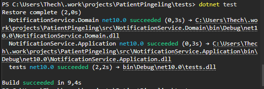

# Testrapportage — Unit Testen

## Inleiding

Dit document is de testrapportage voor de unit testen van de **PatientPingeling communicatiemodule**. Het doel van deze rapportage is aan te tonen dat het systeem:

- **Betrouwbaar** is: de businesslogica werkt correct in alle relevante scenario's, inclusief foutsituaties.
- **Uitbreidbaar** is: de architectuur en testopzet maken het eenvoudig om nieuwe functionaliteit te voegen zonder bestaande testen te breken.

De testen richten zich op de **Application-laag** — de kern van de businesslogica — volledig geïsoleerd van externe systemen zoals de database, RabbitMQ en HTTP-providers. Alle externe afhankelijkheden worden vervangen door **Moq** mocks.

---

## Testresultaten

| Gegeven | Waarde |
| ------- | ------ |
| Testframework | MSTest 4.2.3 |
| Mocking library | Moq 4.20.72 |
| Totaal aantal testen | **53** |
| Geslaagd | **53** |
| Gefaald | **0** |
| Overgeslagen | **0** |
| Uitvoeringstijd | ~500 ms |

```
Passed! - Failed: 0, Passed: 53, Skipped: 0, Total: 53
```

#### Screenshot — Testresultaten



---

## Code Coverage

Code coverage wordt gemeten met `coverlet.collector` en geeft aan welk percentage van de broncode daadwerkelijk door de testen wordt uitgevoerd.

| Meting | Waarde |
| ------ | ------ |
| **Line coverage** (Application + Domain) | ~91% |
| **Branch coverage** (Application + Domain) | ~89% |

Een branch coverage van ~89% betekent dat nagenoeg alle beslissingstakken (if/else, switch, null-checks) getest zijn. De niet-gedekte branches zijn bewust buiten scope gelaten (infrastructure-laag: database drivers, HTTP-clients).

---

## Aantoning van betrouwbaarheid

Betrouwbaarheid wordt aangetoond door voor iedere service **alle relevante paden** te testen: het succesgeval, foutsituaties en randgevallen.

### AppointmentIngestionService (22 testen)

Dit is de meest kritieke service — het verwerkt binnenkomende webhook-events van OpenMRS.

| Scenario | Getest? | Verwacht resultaat |
| -------- | ------- | ------------------ |
| Null command | ✅ | `ErrorType.Validation` |
| Lege ExternalId | ✅ | `ErrorType.Validation` |
| Onbekende action | ✅ | `ErrorType.Validation` |
| CREATED — nieuw appointment, nieuwe patiënt | ✅ | Success, patiënt + appointment opgeslagen |
| CREATED — nieuw appointment, bestaande patiënt | ✅ | Success, patiënt **niet** opnieuw aangemaakt |
| CREATED — duplicate appointment | ✅ | `ErrorType.Duplicate` |
| CREATED — database fout bij ophalen patiënt | ✅ | `ErrorType.Failure` |
| CREATED — database fout bij ophalen appointment | ✅ | `ErrorType.Failure` |
| CREATED — transactie mislukt | ✅ | `ErrorType.Failure`, rollback uitgevoerd |
| CREATED — afspraak >24u vooruit | ✅ | 2 scheduled notifications (24h + 1h herinnering) |
| CREATED — afspraak <1u vooruit | ✅ | 1 directe notification |
| CREATED — afspraak 1-24u, dicht bij 1u herinnering | ✅ | 1 notification (alleen 1h-herinnering) |
| CREATED — afspraak 1-24u, ver van 1u herinnering | ✅ | 2 notifications |
| CANCELLED — appointment niet gevonden | ✅ | `ErrorType.NotFound` |
| CANCELLED — database fout | ✅ | `ErrorType.Failure` |
| CANCELLED — succesvol geannuleerd | ✅ | Success, `IsCancelled = true`, CANCELLED logs geschreven |
| UPDATED — appointment niet bekend → upsert | ✅ | Success, nieuw appointment aangemaakt |
| UPDATED — database fout | ✅ | `ErrorType.Failure` |
| UPDATED — tijd gewijzigd → oude notifications geannuleerd | ✅ | CANCELLED logs + nieuwe notifications |
| UPDATED — tijd ongewijzigd → geen herplanning | ✅ | Geen nieuwe notifications aangemaakt |
| UPDATED — patiëntdata gewijzigd | ✅ | `UpdateAsync` aangeroepen voor patiënt |

### TenantService (7 testen)

Verantwoordelijk voor het valideren van API-keys van tenants bij elke inkomende webhook.

| Scenario | Getest? | Verwacht resultaat |
| -------- | ------- | ------------------ |
| Lege `tenantId` | ✅ | `ErrorType.Validation` |
| Lege `apiKey` | ✅ | `ErrorType.Validation` |
| Whitespace `apiKey` | ✅ | `ErrorType.Validation` |
| Database gooit exception | ✅ | `ErrorType.Failure` |
| Tenant niet gevonden | ✅ | `ErrorType.NotFound` |
| API-key klopt niet | ✅ | `ErrorType.Unauthorized` |
| Correcte API-key | ✅ | `Result.IsSuccess` |

### NotificationDispatchService (7 testen)

Verantwoordelijk voor het kiezen van het juiste communicatieformat en het aanroepen van de provider.

| Scenario | Getest? | Verwacht resultaat |
| -------- | ------- | ------------------ |
| Geen enkel format past (geen email, geen telefoon) | ✅ | `ErrorType.Validation` |
| Decryptie van credentials mislukt | ✅ | `ErrorType.Failure` |
| Provider `SendAsync` gooit exception | ✅ | `ErrorType.Failure` |
| Email-format — success | ✅ | `Result.IsSuccess`, extern bericht-ID teruggegeven |
| SMS-format — juiste ontvanger | ✅ | Telefoonnummer als recipient |
| Push-format — juiste ontvanger | ✅ | Telefoonnummer als recipient |

### NotificationMessageFactory (8 testen)

Verrijkt scheduled notifications met patiënt- en tenantdata vóór publicatie naar RabbitMQ.

| Scenario | Getest? | Verwacht resultaat |
| -------- | ------- | ------------------ |
| Lege input | ✅ | Lege array, geen DB-aanroepen |
| Alle notifications al in queue (INQUEUE) | ✅ | Lege array, details niet opgehaald |
| Notification zonder log → eligible | ✅ | Details worden opgehaald |
| Notification met NEW-status → eligible | ✅ | Details worden opgehaald |
| Details zijn `null` | ✅ | Notification overgeslagen |
| Tenant heeft geen credentials | ✅ | Notification overgeslagen |
| Geldige notification met credentials | ✅ | `NotificationMessage` correct opgebouwd |
| Mix van eligible en ineligible | ✅ | Alleen eligible worden verwerkt |

### Result & Error domeintypen (9 testen)

Het `Result<T>` pattern wordt door alle services gebruikt voor foutafhandeling zonder exceptions.

| Scenario | Getest? | Verwacht resultaat |
| -------- | ------- | ------------------ |
| `Result.Success()` → correct aangemaakt | ✅ | `IsSuccess = true` |
| `Result.Failure(error)` → correct aangemaakt | ✅ | `IsFailure = true`, error properties kloppen |
| Success aanmaken met non-None error | ✅ | `InvalidOperationException` |
| Failure aanmaken met `Error.None` | ✅ | `InvalidOperationException` |
| `Result<T>.Value` bij success | ✅ | Waarde correct teruggegeven |
| `Result<T>.Value` bij failure | ✅ | `InvalidOperationException` |
| `Error.None` heeft lege code en message | ✅ | Code en message zijn leeg |
| `Error` zonder expliciet type → standaard `Failure` | ✅ | `ErrorType.Failure` |

---

## Aantoning van uitbreidbaarheid

Uitbreidbaarheid wordt aangetoond op twee niveaus: **in het systeem zelf** en **in de testopzet**.

### Uitbreidbaarheid van het systeem

De Application-laag is opgebouwd rondom interfaces (`IAppointmentIngestionService`, `IMessageProvider`, `ITenantService`, etc.). Nieuwe implementaties kunnen worden toegevoegd zonder bestaande code aan te passen — conform het **Open/Closed Principle**.

Voorbeeld: een nieuwe messaging provider (bijv. "PushPro") toevoegen vereist:
1. Een nieuwe klasse die `IMessageProvider` implementeert.
2. Registratie in de DI-container via `AddKeyedScoped`.
3. De bestaande `MessageProviderFactory`, `NotificationDispatchService` en alle testen hoeven **niet** gewijzigd te worden.

### Uitbreidbaarheid van de testopzet

De testen zijn zo opgezet dat nieuwe scenario's eenvoudig toegevoegd kunnen worden:

**Helper-methoden per testklasse** vermijden dubbele setup-code:

```csharp
// Eén aanroep configureert de volledige happy-path
private void SetupNewAppointmentFlow() { ... }

// Capture-patroon om return-waarden te inspecteren
private List<ScheduledNotification> CaptureNotifications() { ... }
```

**Centraal command-buildertje** maakt variaties eenvoudig:

```csharp
private IngestAppointmentCommand Cmd(AppointmentAction action, DateTimeOffset? scheduledAt = null) =>
    new(action, TenantId, ValidPatient,
        new AppointmentInfo(..., scheduledAt ?? FarFutureAppointment.ScheduledAt, ...));
```

Hierdoor kost een extra test voor een nieuw scenario slechts een paar regels:

```csharp
[TestMethod]
public async Task IngestAsync_Created_PastAppointment_CreatesImmediateNotification()
{
    SetupNewAppointmentFlow();
    var captured = CaptureNotifications();
    await _service.IngestAsync(Cmd(AppointmentAction.CREATED, scheduledAt: DateTimeOffset.UtcNow.AddMinutes(-5)));
    Assert.AreEqual(1, captured.Count);
}
```

---

## Conclusie

| Aspect | Bevinding |
| ------ | --------- |
| **Betrouwbaarheid** | 53 van 53 testen slagen. Alle kritieke paden, foutsituaties en randgevallen zijn gedekt. Branch coverage van ~89% toont aan dat nagenoeg alle beslissingstakken getest zijn. |
| **Uitbreidbaarheid** | Interface-gebaseerde architectuur maakt nieuwe implementaties mogelijk zonder bestaande code te wijzigen. Testopzet met helpers en builder-patronen maakt nieuwe testen toevoegen eenvoudig. |
